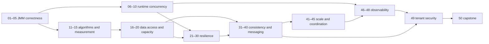

# Learning Path and Dependency Graph

The numeric order is the recommended first pass. Dependencies are directed and
permit focused tracks without pretending the curriculum is a single chain.

## Recommended tracks

- JVM/concurrency: 01 → 02 → 03 → 04 → 05 → 07 → 08 → 09 → 10.
- Performance: 11 → 12 → 13 → 14 → 15 → 16 → 17 → 18 → 20.
- HTTP resilience: 07 → 20 → 21 → 22 → 24 → 25 → 27 → 28 → 29 → 30.
- Messaging, lower cognitive load: 23 → 31 → 32 → 33 → 38 → 37 → 39 → 36 → 40.
- Cloud scale: 19 → 34 → 41 → 42; 28 → 40 → 43; 34 → 45.
- Operations/security: 10 → 46 → 47 → 48 → 49 → 50.

## Machine-readable prerequisite table

| IDs | Direct prerequisites |
|---|---|
| 01 | — |
| 02 | 01 |
| 03 | 01, 02 |
| 04 | 02 |
| 05 | 01 |
| 06 | 01, 05 |
| 07 | 01 |
| 08 | 05, 07 |
| 09 | 07, 08 |
| 10 | 04, 09 |
| 11 | 04 |
| 12 | 11 |
| 13 | 12 |
| 14 | 12, 13 |
| 15 | 11–14 |
| 16 | 11, 15 |
| 17 | 11, 16 |
| 18 | 17 |
| 19 | 07, 11 |
| 20 | 07, 16, 17 |
| 21 | 07, 09, 20 |
| 22 | 21 |
| 23 | 01, 03, 16, 21, 22 |
| 24 | 21, 22 |
| 25 | 07, 08, 20, 21 |
| 26 | 03, 07, 21 |
| 27 | 07, 20, 21, 25, 26 |
| 28 | 21, 24, 25 |
| 29 | 08, 09, 21, 22, 24, 25, 28 |
| 30 | 07, 09, 21, 27 |
| 31 | 16, 20, 23 |
| 32 | 22, 31 |
| 33 | 23, 31, 32 |
| 34 | 01, 03, 16, 23 |
| 35 | 05, 20, 34 |
| 36 | 30–35 |
| 37 | 09, 31–33 |
| 38 | 22, 30, 33 |
| 39 | 19, 32, 33, 37 |
| 40 | 28, 33, 38, 39 |
| 41 | 07, 20, 23, 30 |
| 42 | 34, 37, 41 |
| 43 | 06, 27, 28, 40, 41 |
| 44 | 31–34, 39 |
| 45 | 05, 34, 41 |
| 46 | 10, 21, 29 |
| 47 | 20–29, 46 |
| 48 | 10, 32, 37, 46 |
| 49 | 23, 41, 46, 48 |
| 50 | 16, 20–23, 30–41, 46–49 |

## Proposed implementation batches after representative approval

1. Representative: 01 only.
2. 02–04.
3. 05–07.
4. 08–10.
5. 11–13.
6. 14–15.
7. 16–18.
8. 19–21.
9. 22–24.
10. 25–27.
11. 28–30.
12. 31–33.
13. 34–36.
14. 37–39.
15. 40–42.
16. 43–45.
17. 46–48.
18. 49.
19. 50 and final audit.

Batch boundaries may move only to reduce conflicting file ownership or container
load; the prerequisite graph and quality gates remain authoritative.
